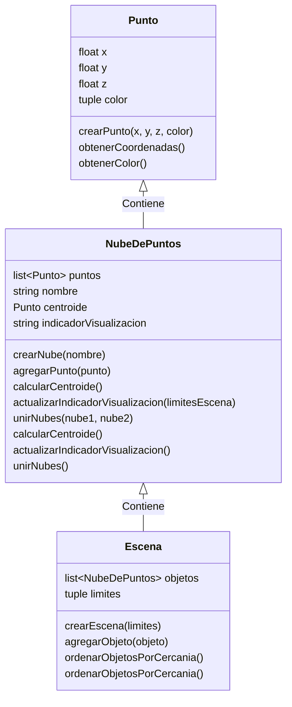

# Diseño de TADs para Visualización 3D

## TAD Punto

**Descripción**: Representa un punto en un espacio tridimensional.

### Especificaciones
- **Atributos**:
  - `x`: Coordenada en el eje X.
  - `y`: Coordenada en el eje Y.
  - `z`: Coordenada en el eje Z.
  - `color`: Color del punto representado por un arreglo de 3 enteros (rojo, verde, azul) en el rango de 0 a 255.

### Operaciones
- **Crear**: Crea un nuevo punto con coordenadas y color especificados.
- **Obtener Coordenadas**: Devuelve las coordenadas (x, y, z) del punto.
- **Obtener Color**: Devuelve el color del punto.

## TAD NubeDePuntos

**Descripción**: Representa un conjunto de puntos que forman una nube de puntos tridimensional.

### Especificaciones
- **Atributos**:
  - `puntos`: Lista de puntos que conforman la nube.
  - `nombre`: Nombre asociado a la nube de puntos.
  - `centroide`: Punto que representa el centroide de la nube.
  - `indicadorDeVisualizacion`: Estado de la visualización (completa, parcial, nula).

### Operaciones
- **Actualizar Indicador de Visualización**: Revisa los puntos de la nube con respecto a los límites de la escena y actualiza el indicador de visualización.
- **Calcular Centroide**: Calcula el punto promedio de todos los puntos en la nube.
- **Agregar Punto**: Añade un nuevo punto a la nube de puntos.

## TAD Escena

**Descripción**: Representa el espacio tridimensional donde se visualizan las nubes de puntos.

### Especificaciones
- **Atributos**:
  - `limites`: Límites de la escena en los ejes X, Y y Z.
  - `objetos`: Lista de objetos (nubes de puntos) en la escena.

### Operaciones
- **Agregar Objeto**: Añade una nueva nube de puntos a la escena, ubicándola en función de su cercanía al observador.
- **Unir Objetos**: Crea un nuevo objeto combinando las nubes de puntos de dos objetos existentes, utilizando el punto más cercano en caso de coincidencia de coordenadas.
- **Ordenar Objetos**: Organiza los objetos de la escena de acuerdo a la cercanía al observador, para asegurar que los objetos más cercanos se dibujan después de los más lejanos.
- **Actualizar Visualización**: Actualiza el indicador de visualización para cada objeto en la escena.

## TAD Objeto

**Descripción**: Representa una entidad que se dibuja en la escena. Se puede considerar una extensión de `NubeDePuntos` en el contexto de la escena.

### Especificaciones
- **Atributos**:
  - `nubeDePuntos`: Nube de puntos asociada al objeto.
  - `distanciaAlObservador`: Distancia del objeto al observador de la escena.

### Operaciones
- **Actualizar**: Actualiza la nube de puntos y la distancia al observador.
- **Reubicar**: Reubica el objeto en la escena para mantener la organización por cercanía.

# Diagrama de TADs.

