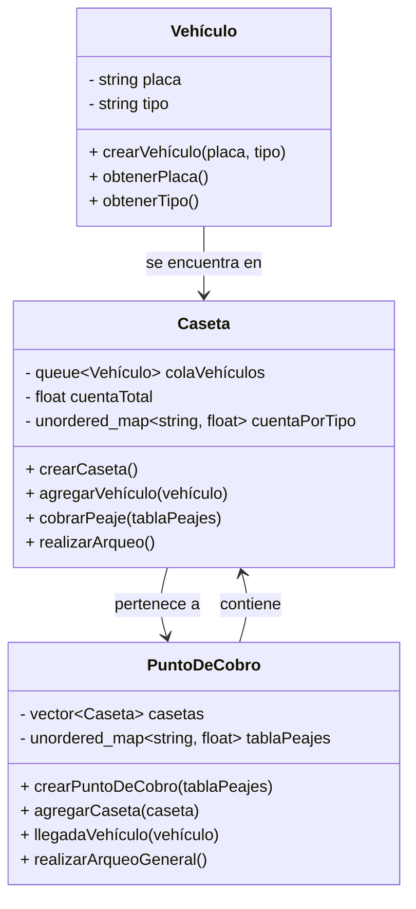

# Diseño e Implementación de TADs para el Cobro de Peajes

## Descripción del Sistema

El sistema de cobro de peajes se encarga de gestionar el mantenimiento y expansión de la infraestructura vial inter-municipal a través de concesiones. Los tramos específicos son entregados a empresas privadas que los mantienen en condiciones adecuadas para el tránsito de vehículos. El sistema debe modelar la llegada de vehículos, el cobro del peaje y el arqueo de caja de las casetas.

## TADs

### TAD Vehículo
**Descripción**: Representa un vehículo que transita por el punto de cobro.

**Atributos**:
- `placa`: Identificación única del vehículo.
- `tipo`: Tipo de vehículo (determina el valor del peaje).

**Operaciones**:
- `crearVehículo(placa, tipo)`: Crea un nuevo vehículo con la placa y tipo especificados.
- `obtenerPlaca()`: Retorna la placa del vehículo.
- `obtenerTipo()`: Retorna el tipo del vehículo.

### TAD Caseta
**Descripción**: Representa una caseta de cobro en el punto de peaje.

**Atributos**:
- `colaVehículos`: Cola de vehículos esperando para pagar el peaje.
- `cuentaTotal`: Total de dinero recaudado.
- `cuentaPorTipo`: Total de dinero recaudado por tipo de vehículo.

**Operaciones**:
- `crearCaseta()`: Crea una nueva caseta de cobro.
- `agregarVehículo(vehículo)`: Agrega un vehículo a la cola de la caseta.
- `cobrarPeaje()`: Realiza el cobro del peaje para el vehículo en la parte frontal de la cola.
- `realizarArqueo()`: Realiza el arqueo de caja y reinicia las cuentas.

### TAD PuntoDeCobro
**Descripción**: Representa el punto de cobro de peaje con varias casetas.

**Atributos**:
- `casetas`: Lista de casetas en el punto de cobro.
- `tablaPeajes`: Tabla con los valores de peaje por tipo de vehículo.

**Operaciones**:
- `crearPuntoDeCobro(tablaPeajes)`: Crea un nuevo punto de cobro con la tabla de peajes especificada.
- `agregarCaseta(caseta)`: Agrega una caseta al punto de cobro.
- `llegadaVehículo(vehículo)`: Modela la llegada de un vehículo al punto de cobro.
- `realizarArqueoGeneral()`: Realiza el arqueo de caja de todas las casetas y retorna el monto total recaudado.

# Diagrma de relación.

