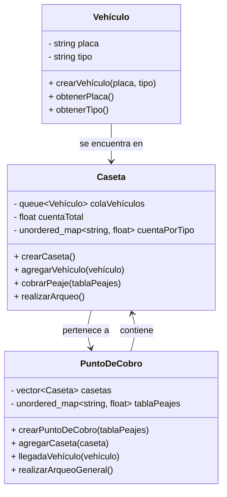

# Diseño e Implementación de TADs para el Cobro de Peajes

## Descripción del Sistema

El sistema de cobro de peajes se encarga de gestionar el mantenimiento y expansión de la infraestructura vial inter-municipal a través de concesiones. Los tramos específicos son entregados a empresas privadas que los mantienen en condiciones adecuadas para el tránsito de vehículos. El sistema debe modelar la llegada de vehículos, el cobro del peaje y el arqueo de caja de las casetas.

## TADs

### TAD Vehículo
**Descripción**: Representa un vehículo que transita por el punto de cobro.

**Atributos**:
- `placa`: Identificación única del vehículo.
- `tipo`: Tipo de vehículo (determina el valor del peaje).

**Operaciones**:
- `crearVehículo(placa, tipo)`: Crea un nuevo vehículo con la placa y tipo especificados.
- `obtenerPlaca()`: Retorna la placa del vehículo.
- `obtenerTipo()`: Retorna el tipo del vehículo.

### TAD Caseta
**Descripción**: Representa una caseta de cobro en el punto de peaje.

**Atributos**:
- `colaVehículos`: Cola de vehículos esperando para pagar el peaje.
- `cuentaTotal`: Total de dinero recaudado.
- `cuentaPorTipo`: Total de dinero recaudado por tipo de vehículo.

**Operaciones**:
- `crearCaseta()`: Crea una nueva caseta de cobro.
- `agregarVehículo(vehículo)`: Agrega un vehículo a la cola de la caseta.
- `cobrarPeaje()`: Realiza el cobro del peaje para el vehículo en la parte frontal de la cola.
- `realizarArqueo()`: Realiza el arqueo de caja y reinicia las cuentas.

### TAD PuntoDeCobro
**Descripción**: Representa el punto de cobro de peaje con varias casetas.

**Atributos**:
- `casetas`: Lista de casetas en el punto de cobro.
- `tablaPeajes`: Tabla con los valores de peaje por tipo de vehículo.

**Operaciones**:
- `crearPuntoDeCobro(tablaPeajes)`: Crea un nuevo punto de cobro con la tabla de peajes especificada.
- `agregarCaseta(caseta)`: Agrega una caseta al punto de cobro.
- `llegadaVehículo(vehículo)`: Modela la llegada de un vehículo al punto de cobro.
- `realizarArqueoGeneral()`: Realiza el arqueo de caja de todas las casetas y retorna el monto total recaudado.

# Diagrma de relación.



## Implementación en C++

```cpp
/*************************************************************************
Autor: Jan Marco Muñoz Pineda
Fecha: 19/08/2024
Descripción: Implementación tipo parcial peaje c++
*************************************************************************/

#include <iostream>
#include <vector>
#include <queue>
#include <unordered_map>

// Estructura que representa un vehículo
struct Vehículo {
    std::string placa; // Placa del vehículo
    std::string tipo;  // Tipo de vehículo (ej: auto, camión)

    // Constructor para inicializar un vehículo con su placa y tipo
    Vehículo(std::string p, std::string t) : placa(p), tipo(t) {}
};

// Estructura que representa una caseta de peaje
struct Caseta {
    std::queue<Vehículo> colaVehículos; // Cola de vehículos esperando en la caseta
    float cuentaTotal = 0; // Monto total recaudado en la caseta
    std::unordered_map<std::string, float> cuentaPorTipo; // Monto recaudado por tipo de vehículo

    // Agrega un vehículo a la cola de la caseta
    void agregarVehículo(Vehículo v) {
        colaVehículos.push(v);
    }

    // Cobra el peaje para el vehículo al frente de la cola
    void cobrarPeaje(std::unordered_map<std::string, float>& tablaPeajes) {
        if (!colaVehículos.empty()) { // Verifica si hay vehículos en la cola
            Vehículo v = colaVehículos.front(); // Obtiene el primer vehículo en la cola
            colaVehículos.pop(); // Elimina el vehículo de la cola
            float peaje = tablaPeajes[v.tipo]; // Obtiene el monto del peaje según el tipo de vehículo
            cuentaTotal += peaje; // Suma el peaje al total recaudado
            cuentaPorTipo[v.tipo] += peaje; // Suma el peaje al total por tipo de vehículo
            std::cout << "Vehículo " << v.placa << " pagó " << peaje << " en peaje.\n"; // Imprime un mensaje de cobro
        }
    }

    // Realiza un arqueo de caja para la caseta y resetea las cuentas
    void realizarArqueo() {
        std::cout << "Arqueo de caja: " << cuentaTotal << "\n"; // Muestra el total recaudado
        cuentaTotal = 0; // Resetea el total recaudado
        cuentaPorTipo.clear(); // Resetea las cuentas por tipo de vehículo
    }
};

// Estructura que representa un punto de cobro con varias casetas
struct PuntoDeCobro {
    std::vector<Caseta> casetas; // Vector que contiene las casetas del punto de cobro
    std::unordered_map<std::string, float> tablaPeajes; // Tabla de peajes por tipo de vehículo

    // Constructor para inicializar la tabla de peajes
    PuntoDeCobro(std::unordered_map<std::string, float> tp) : tablaPeajes(tp) {}

    // Agrega una caseta al punto de cobro
    void agregarCaseta(Caseta c) {
        casetas.push_back(c);
    }

    // Asigna un vehículo a la caseta con la cola más corta
    void llegadaVehículo(Vehículo v) {
        int minCola = 0; // Índice de la caseta con la cola más corta
        for (int i = 1; i < casetas.size(); ++i) {
            // Encuentra la caseta con la cola más corta
            if (casetas[i].colaVehículos.size() < casetas[minCola].colaVehículos.size()) {
                minCola = i;
            }
        }
        casetas[minCola].agregarVehículo(v); // Agrega el vehículo a la caseta seleccionada
    }

    // Realiza el arqueo general del punto de cobro
    void realizarArqueoGeneral() {
        float totalRecaudado = 0; // Variable para el total recaudado en todas las casetas
        for (auto& caseta : casetas) {
            caseta.realizarArqueo(); // Realiza el arqueo de cada caseta
            totalRecaudado += caseta.cuentaTotal; // Suma lo recaudado en cada caseta
        }
        std::cout << "Total recaudado en todas las casetas: " << totalRecaudado << "\n"; // Imprime el total general recaudado
    }
};

int main() {
    // Tabla de peajes por tipo de vehículo
    std::unordered_map<std::string, float> tablaPeajes = {{"auto", 5000}, {"camion", 10000}};
    PuntoDeCobro punto(tablaPeajes); // Crea el punto de cobro con la tabla de peajes

    // Crea dos casetas de peaje y las agrega al punto de cobro
    Caseta caseta1, caseta2;
    punto.agregarCaseta(caseta1);
    punto.agregarCaseta(caseta2);

    // Crea dos vehículos con diferentes tipos
    Vehículo v1("ABC123", "auto");
    Vehículo v2("DEF456", "camion");

    // Los vehículos llegan al punto de cobro y se asignan a las casetas
    punto.llegadaVehículo(v1);
    punto.llegadaVehículo(v2);

    // Se cobra el peaje para el vehículo en cada caseta
    punto.casetas[0].cobrarPeaje(tablaPeajes);
    punto.casetas[1].cobrarPeaje(tablaPeajes);

    // Se realiza el arqueo general del punto de cobro
    punto.realizarArqueoGeneral();

    return 0;
}

```
