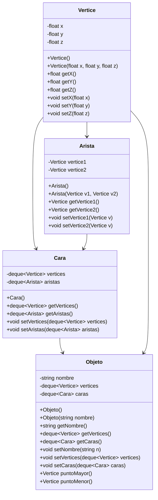

Repositorio de Jan Marco Muñoz para la clase de Estructuras de datos

```mermaid
classDiagram
    class Arista {
        -Vertice vertice1
        -Vertice vertice2
        +Arista()
        +Arista(Vertice v1, Vertice v2)
        +Vertice getVertice1()
        +Vertice getVertice2()
        +void setVertice1(Vertice v)
        +void setVertice2(Vertice v)
    }
    
    class Cara {
        -deque~Vertice~ vertices
        -deque~Arista~ aristas
        +Cara()
        +deque~Vertice~ getVertices()
        +deque~Arista~ getAristas()
        +void setVertices(deque~Vertice~ vertices)
        +void setAristas(deque~Arista~ aristas)
    }
    
    class Objeto {
        -string nombre
        -deque~Vertice~ vertices
        -deque~Cara~ caras
        +Objeto()
        +Objeto(string nombre)
        +string getNombre()
        +deque~Vertice~ getVertices()
        +deque~Cara~ getCaras()
        +void setNombre(string n)
        +void setVertices(deque~Vertice~ vertices)
        +void setCaras(deque~Cara~ caras)
        +Vertice puntoMayor()
        +Vertice puntoMenor()
    }
    
    class Vertice {
        -float x
        -float y
        -float z
        +Vertice()
        +Vertice(float x, float y, float z)
        +float getX()
        +float getY()
        +float getZ()
        +void setX(float x)
        +void setY(float y)
        +void setZ(float z)
    }
    
    Vertice --> Arista
    Vertice --> Cara
    Arista --> Cara
    Cara --> Objeto
    Vertice --> Objeto
```
