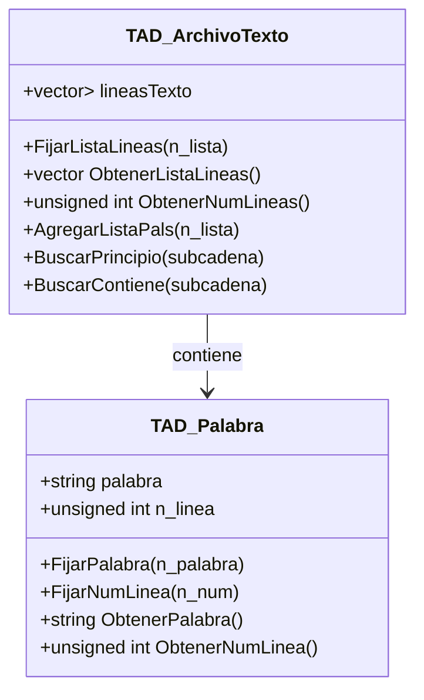

## TADs Incluidos  

- **TAD Palabra**: Representa una palabra y su posición en un archivo.  
- **TAD ArchivoTexto**: Representa un archivo de texto y permite realizar diversas operaciones sobre el contenido de sus líneas.  

# TAD Palabra  

## Descripción  
Esta TAD representa una palabra y su posición en un archivo de texto.  

## Atributos  
- **palabra**: cadena de caracteres que representa la palabra a almacenar.  
- **n_linea**: entero sin signo que representa el número de línea en el que se encuentra la palabra.  

## Operaciones  
1. **FijarPalabra(n_palabra)**  
   - Descripción: Cambia la palabra actual a `n_palabra`.  
   - Parámetros: `n_palabra` (cadena de caracteres).  
   - Valor de retorno: void.  

2. **FijarNumLinea(n_num)**  
   - Descripción: Cambia el número de línea actual a `n_num`.  
   - Parámetros: `n_num` (entero sin signo).  
   - Valor de retorno: void.  

3. **ObtenerPalabra()**  
   - Descripción: Retorna la palabra almacenada.  
   - Valor de retorno: cadena de caracteres.  

4. **ObtenerNumLinea()**  
   - Descripción: Retorna el número de línea actual de la palabra.  
   - Valor de retorno: entero sin signo.

# TAD ArchivoTexto  

## Descripción  
Esta TAD representa un archivo de texto y permite realizar operaciones sobre sus líneas de texto.  

## Atributos  
- **lineasTexto**: vector de vector de cadenas de caracteres que representa el archivo de texto.  

## Operaciones  
1. **FijarListaLineas(n_lista)**  
   - Descripción: Cambia el vector de líneas de texto por `n_lista`.  
   - Parámetros: `n_lista` (vector de cadenas de caracteres).  
   - Valor de retorno: void.  

2. **ObtenerListaLineas()**  
   - Descripción: Retorna el vector de líneas de texto.  
   - Valor de retorno: vector de cadenas de caracteres.  

3. **ObtenerNumLineas()**  
   - Descripción: Retorna la cantidad de líneas de texto en el archivo.  
   - Valor de retorno: entero.  

4. **AgregarListaPals(n_lista)**  
   - Descripción: Agrega una nueva línea de texto al vector.  
   - Parámetros: `n_lista` (cadena de caracteres).  
   - Valor de retorno: void.  

5. **BuscarPrincipio(subcadena)**  
   - Descripción: Busca la subcadena al principio de cada palabra.  
   - Parámetros: `subcadena` (cadena de caracteres).  
   - Valor de retorno: void.  

6. **BuscarContiene(subcadena)**  
   - Descripción: Busca la subcadena dentro de cada palabra.  
   - Parámetros: `subcadena` (cadena de caracteres).  
   - Valor de retorno: void.

